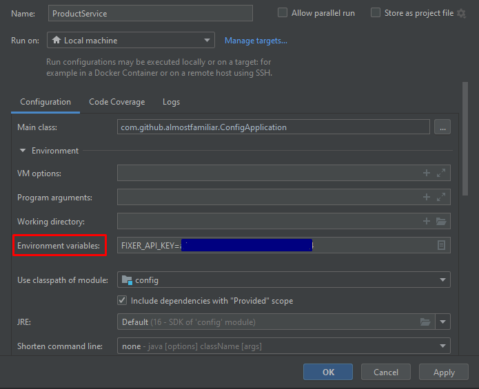

# product-service

CRUD-API to manage products in categories

## Challenge

The challenge is to design a CRUD service for products in categories. 
Currencies can be converted by calling a 3rd party API. 

## How to run

### Prerequisites

- Maven
- Java 16
- Docker/docker-compose or neo4j database

### Build & Run

Set your FIXER_API_KEY environment variable to your fixer.io key.

Build and generate auto generated classes:

```
cd backend
mvn clean install
```

Make sure you set your fixer api key as environment variable with the name of FIXER_API_KEY. In
IntelliJ one would do that in the run configurations here:



To start the database run:

```
docker-compose -f neo4j-docker-compose.yml up
```

There is no volume configured, so all data will be lost.

Run the Spring Application from the main class in

```
backend/product-main/src/main/java/com/github/almostfamiliar/ConfigApplication.java
```

There will be some initial data created by liquibase scripts.

### How to use the app

The api is documented by swagger at:

```
http://localhost:8080/swagger-ui/index.html?configUrl=/v3/api-docs/swagger-config
```

The database can be inspected at:

```
http://localhost:7474/
```

With the following query all the data from the application can be views. (without the liquigraph
"noise")

```
MATCH (n:Category) MATCH (p:Product) RETURN n,p
```

A Postman collection with some examples is available in:

```
/documents/product-service.postman_collection.json
```

The frontend did not finish in time.

## Concept Phase

### Defining the Rules

The challenge is to write a service which allows managing products in categories.

I decided on the following requirements:

- Each category can have unlimited sub categories.
- The immediate subcategory can not have the same name as any other immediate subcategory.
- None of the parents of a subcategory can have the same name as the subcategory.
- Product names have to be unique in the system
- Categories can only be deleted, if they are empty (no products, no subcategory)
- Products can belong to multiple categories

### Frontend

The frontend will be a single page application implemented in react, as required by the exercise. As
I have no knowledge of react at all I will struggle with producing high quality software in this
part. Knowing this I will allocate a significant amount of time into this part to learn the basics (
probably sunday), but I will focus my efforts on the backend in terms of quality of the software.

### Backend

Technologies in the service have to be Spring Boot with Java.

#### Architecture Considerations

The question of which architecture type is appropriate for this type of application is not easy to
answer.

On the one hand the use case seems fairly simple at first glance, which would speak for a simple
layered architecture with minimal constraints for simplicity.

On the other hand the feature to convert currencies and already foreseeable changes to the API,
speak for the fact that this service will evolve into a more complex service. Managing the hierarchy
of categories will require a decent amount of logic as well.

#### Conclusion

From the specifications as they are I would certainly recommend a simple layered architecture. I
decided to go with the more "complicated" approach in the hexagonal architecture though, for the
following reasons:

- From the specification the direction of this project is very unclear. Most (/a lot of?) projects
  evolve to a service with logic from a CRUD app. Finding the point at, which to refactor the code
  is very hard to detect and often missed.

- The project already has a lot of not immediately obvious logic already. For example when changing
  the location of a subcategory, the impact on other categories has to be considered.

- Database considerations. As shown in the following point my database decision is not made with
  100% confidence and may be even controversial. There may be unexpected problems with the unknown
  tech of graph databases, which require a refactor to a different type of persistence. To avoid
  database-driven-design, we need dependency inversion for this use case.

- "Product-Service" sounds like something that would evolve to something bigger over time, but that
  may just be me.

- As this is a demo project to showcase how I would model most services, I would like to show how I
  would like to model a slightly more complicated setup, which takes extensibility maybe more into
  account than I usually would.

### Database

The data model is certainly a challenge with this problem. At first glance it seems simple:


There is a challenge though: The recursive relationship between categories.

Here are my thoughts in order how to solve this problem:

1. Graph Database

The type of hierarchy screams tree structure to me. Graph databases immediately come to mind as they
are designed to deal with datasets like these.

| Pros  | Cons |
| ------------- | ------------- |
| Fast  | I do not know much about graph databases  |
| Intuitive  |   |

2. Flat Table

Thinking about the usage patterns I thought about dropping the categories table all together and
representing the categories as a key (e.g. /clothes/winter/men) similar to how S3 manages its data.
An index on this key would make queries by category really fast.

| Pros  | Cons |
| ------------- | ------------- |
| Simple  | Does not really work well, if products have to be in multiple categories |
| Fast queries on products | Queries on the category tree may be slow. This should not be a big problem though, because I would consider this data fairly static and the results can be cached. |

3. Tree with double reference

Modeling a tree with double references to children and parents. The categories would have a list of
products in them, to be able to query easily by category. The products themselves would have a
reference to their categories in them.

| Pros  | Cons |
| ------------- | ------------- |
| Fast queries on both categories and products | Data Redundancy |
| Easy to adjust the model due to no schema | Complicated to keep the double references in sync |

4. Nested Sets Approach

https://de.wikipedia.org/wiki/Nested_Sets

| Pros  | Cons |
| ------------- | ------------- |
| Fast Reads | Slow writes |
|  | I' not very smart and this seems hard |

=> Solution:

I will go with option 1 for the following reasons:

- That I do not much about it. I want to take this opportunity to learn more about it.
- I believe this should be the "correct" solution for this problem.

If I run into problems with this approach due to time trouble, I will revert to option 3.

### Additional thoughts

The calls to the category data can mostly be cached, as this data should rarely change. To make this
service scalable the caching mechanism would need to be extracted to a memory db, which is pretty
fast to set up.

Caching is also used to validate the currencies against the fixer api, to reduce costs.

### Tools and Libs used

- Mapstruct
- ArchUnit
- Liquigraph
- Lombok
- Neo4j
- Swagger
- Feign
- TestContainer

### Notes

The Tests in the persistence layer work when executed in Intellij, but are excluded from the maven
build as they are extremely slow.
